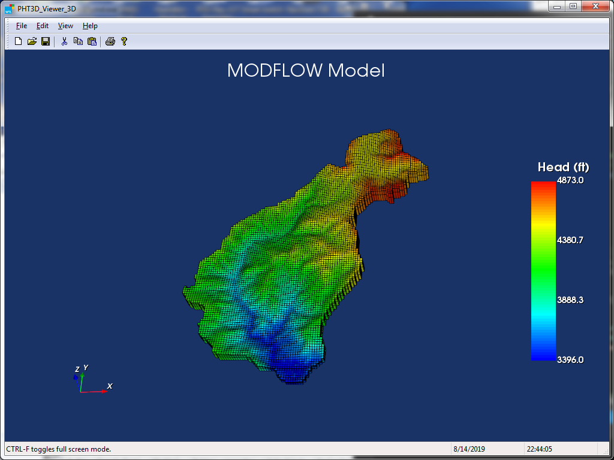
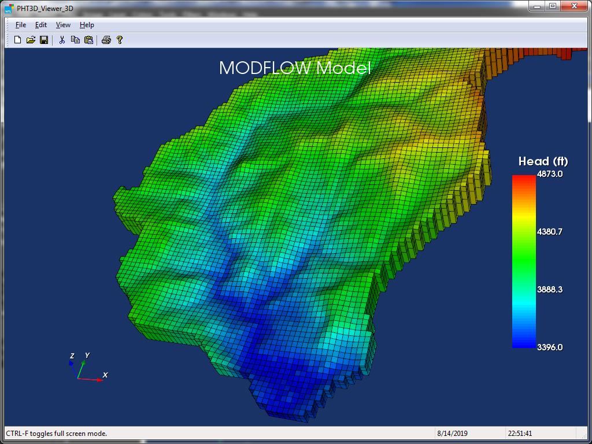
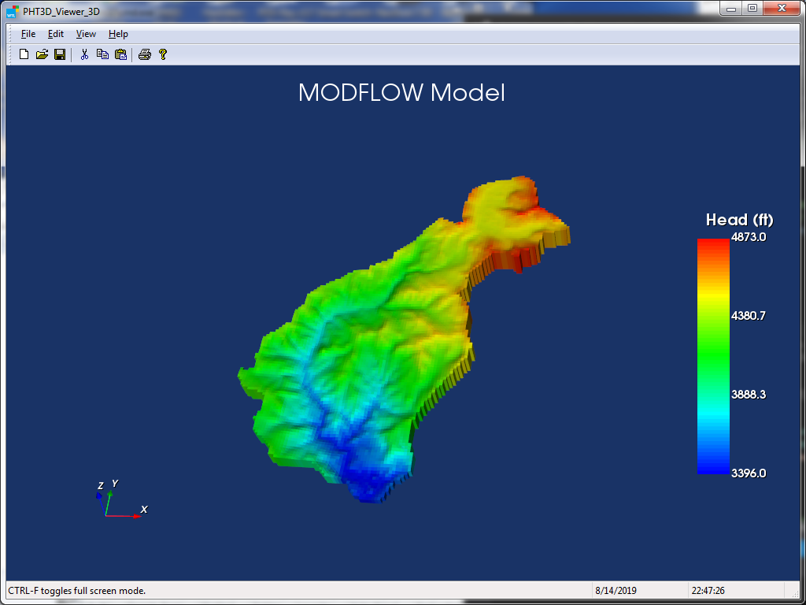
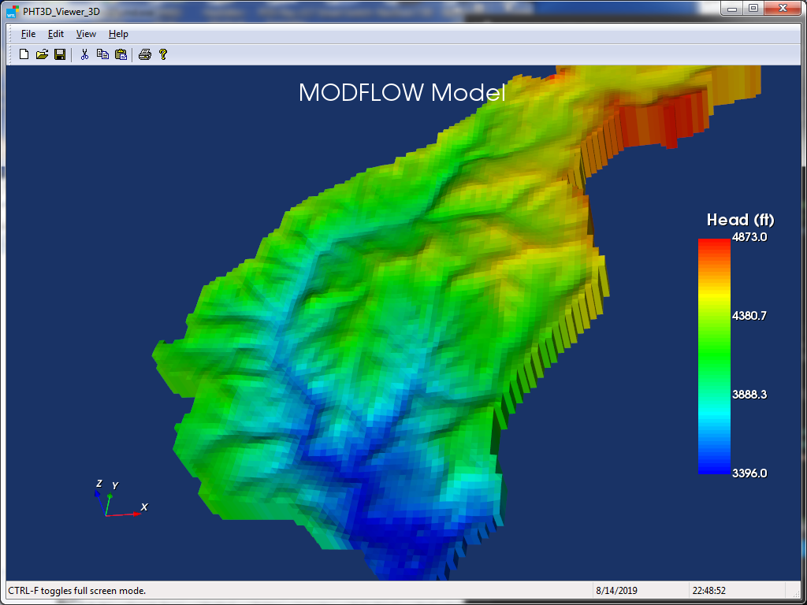

# PHT3D Viewer 3D
A Windows Graphical User Interface to visualize the output of a MODFLOW, MT3DMS, and PHT3D models. It is a C++ application and Standard template library, Windows template library, Boost template library, and VTK library were used.

### Hydraulic head with Grid (Normal View)

### Hydraulic head with Grid and Zoom in

### Hydraulic head without Grid (Normal View)

### Hydraulic head without Grid and Zoom in

